# AdeaAutomation / MailboxAutomation - Mermaid Sequenzdiagramme je UseCase

Diese Datei beschreibt für jeden aktiven UseCase, wo der UseCase im Code beginnt, welche zentralen Skripte, Handler, Services und Gateways durchlaufen werden und wo der UseCase im Datei-Lifecycle endet.

Die Diagramme basieren auf der aktuellen Projektstruktur mit `Invoke-JobProcessor.ps1`, `JobEngine.psm1`, `JobFileQueue.psm1`, `usecases.json`, den UseCase-Handlern, Services und Gateways.

## Gemeinsame Laufzeitlogik

Alle nicht-longRunning UseCases folgen demselben technischen Rahmen: Datei in `queues/incoming` oder fällige Datei in `retry`, Registry-Matching über `config/usecases.json`, Claim nach `processing`, CSV-Import, Context-Erstellung, Handler-Aufruf, Service-Aufruf, Gateway-Aufruf, `JobResult`, danach `Move-JobFileToStatus(done|failed|retry|paused)`.

### DistributionGroup.AddResponsibles

Pattern: `*AddDistributionListResponsibles*_pshjob_.csv`  
Queue: `standard`  
Start im Code: `config/usecases.json` -> `usecases/DistributionGroup/AddDistributionListResponsibles.psm1` -> `Invoke-AddDistributionListResponsibles`  
Ende im Code: `JobFileQueue.Move-JobFileToStatus()` -> `done bei Succeeded, failed bei New-JobFailedResult`

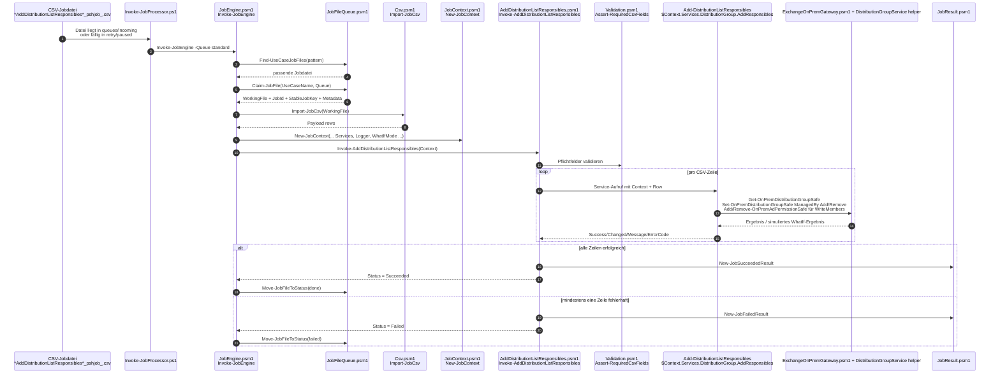

### DistributionGroup.Create

Pattern: `*CreateDistributionList*_pshjob_.csv`  
Queue: `standard`  
Start im Code: `config/usecases.json` -> `usecases/DistributionGroup/CreateDistributionGroup.psm1` -> `Invoke-CreateDistributionGroup`  
Ende im Code: `JobFileQueue.Move-JobFileToStatus()` -> `done bei Succeeded, failed bei New-JobFailedResult`

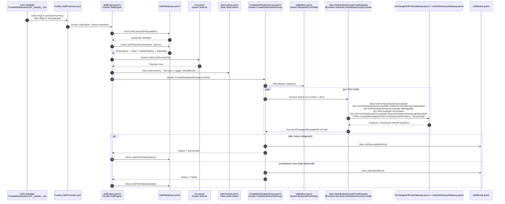

### DistributionGroup.ChangeManager

Pattern: `*ChangeManagerDistribList*_pshjob_.csv`  
Queue: `standard`  
Start im Code: `config/usecases.json` -> `usecases/DistributionGroup/ChangeManagerDistribList.psm1` -> `Invoke-ChangeManagerDistribList`  
Ende im Code: `JobFileQueue.Move-JobFileToStatus()` -> `done bei Succeeded, failed bei New-JobFailedResult`

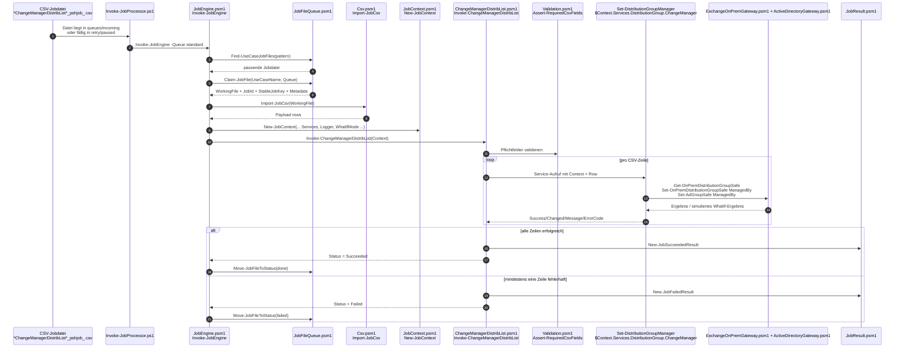

### DistributionGroup.Delete

Pattern: `*DeleteDistribList*_pshjob_.csv`  
Queue: `standard`  
Start im Code: `config/usecases.json` -> `usecases/DistributionGroup/DeleteDistributionList.psm1` -> `Invoke-DeleteDistributionList`  
Ende im Code: `JobFileQueue.Move-JobFileToStatus()` -> `done bei Succeeded, failed bei New-JobFailedResult`

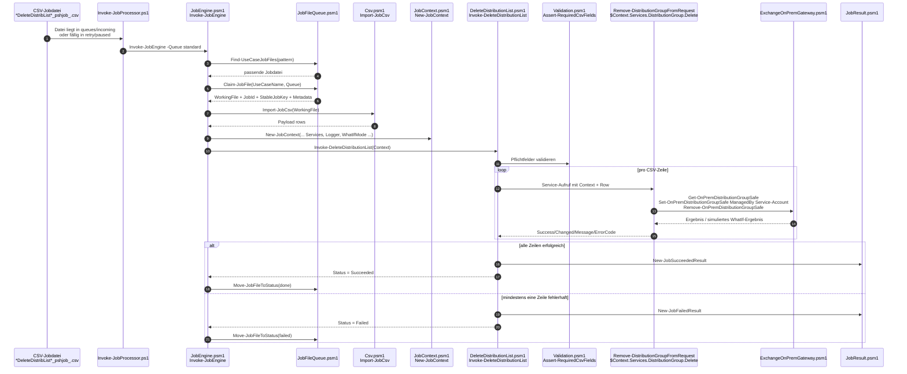

### GroupMailbox.AddFmaMembers

Pattern: `*AddGroupMailboxFmaMembers*_pshjob_.csv`  
Queue: `standard`  
Start im Code: `config/usecases.json` -> `usecases/GroupMailbox/AddGroupMailboxFmaMembers.psm1` -> `Invoke-AddGroupMailboxFmaMembers`  
Ende im Code: `JobFileQueue.Move-JobFileToStatus()` -> `done bei Succeeded, failed bei New-JobFailedResult`

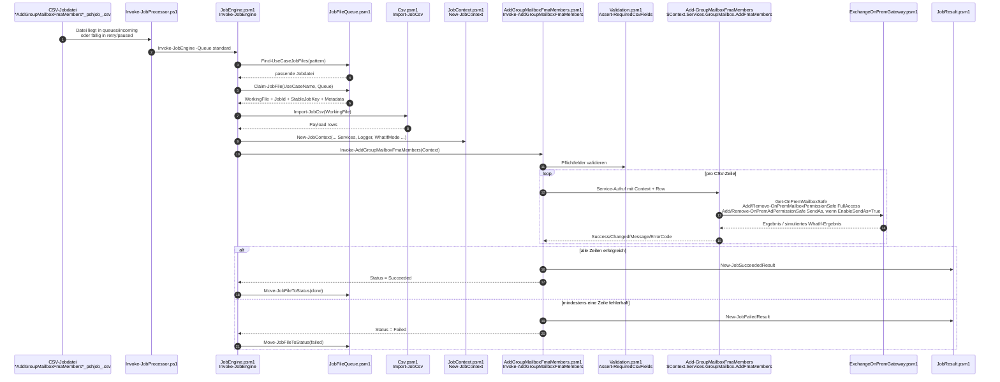

### GroupMailbox.Create

Pattern: `*CreateGroupMailbox*_pshjob_.csv`  
Queue: `standard`  
Start im Code: `config/usecases.json` -> `usecases/GroupMailbox/CreateGroupMailbox.psm1` -> `Invoke-CreateGroupMailbox`  
Ende im Code: `JobFileQueue.Move-JobFileToStatus()` -> `done bei Succeeded, failed bei New-JobFailedResult`

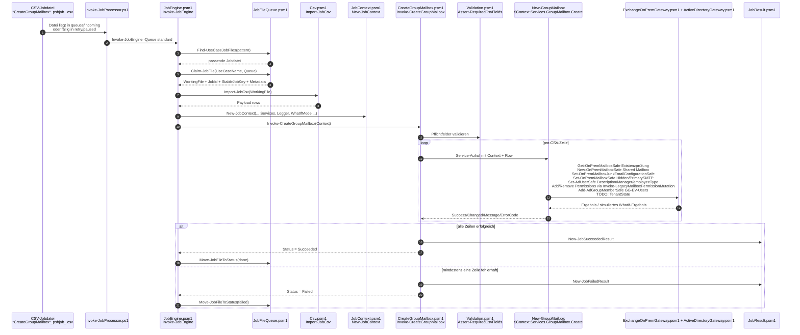

### GroupMailbox.ChangeManager

Pattern: `*ChangeManagerGroupMailbox*_pshjob_.csv`  
Queue: `standard`  
Start im Code: `config/usecases.json` -> `usecases/GroupMailbox/ChangeManagerGroupMailbox.psm1` -> `Invoke-ChangeManagerGroupMailbox`  
Ende im Code: `JobFileQueue.Move-JobFileToStatus()` -> `done bei Succeeded, failed bei New-JobFailedResult`

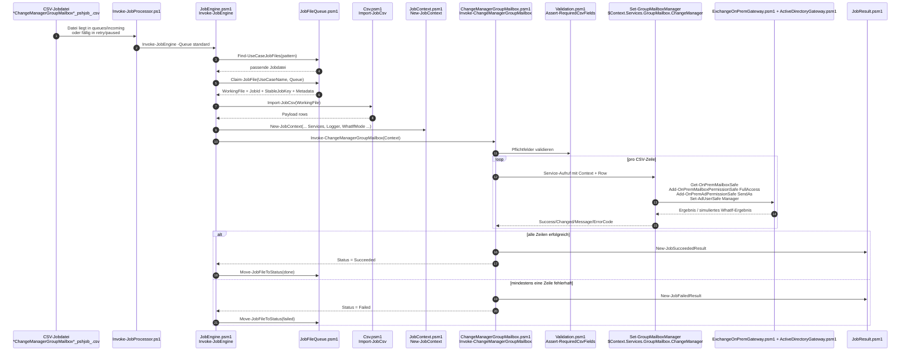

### GenericUser.RenameAccount

Pattern: `*RenameUserAccount*_pshjob_.csv`  
Queue: `standard`  
Start im Code: `config/usecases.json` -> `usecases/GenericUser/RenameUserAccount.psm1` -> `Invoke-RenameUserAccount`  
Ende im Code: `JobFileQueue.Move-JobFileToStatus()` -> `done bei Succeeded, failed bei New-JobFailedResult / PARTIAL_FAILURE`


### GenericUser.ChangeSurname

Pattern: `*ChangeAccountSurname*_pshjob_.csv`  
Queue: `standard`  
Start im Code: `config/usecases.json` -> `usecases/GenericUser/ChangeAccountSurname.psm1` -> `Invoke-ChangeAccountSurname`  
Ende im Code: `JobFileQueue.Move-JobFileToStatus()` -> `done bei Succeeded, failed bei New-JobFailedResult / PARTIAL_FAILURE`


### GenericUser.Enable

Pattern: `*EnableNonStdPersonMailbox*_pshjob_.csv`  
Queue: `standard`  
Start im Code: `config/usecases.json` -> `usecases/GenericUser/EnableGenericUser.psm1` -> `Invoke-EnableGenericUser`  
Ende im Code: `JobFileQueue.Move-JobFileToStatus()` -> `done bei Succeeded, failed bei New-JobFailedResult`

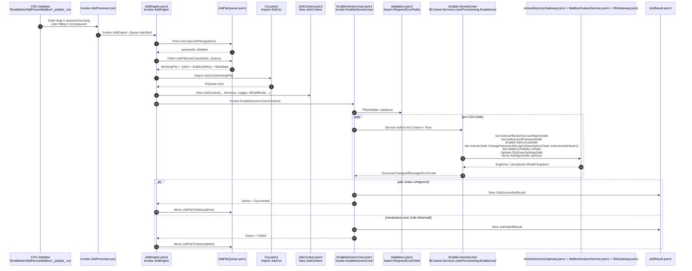

### GenericUser.Disable

Pattern: `*DisableNonStdPersonMailbox*_pshjob_.csv`  
Queue: `standard`  
Start im Code: `config/usecases.json` -> `usecases/GenericUser/DisableGenericUser.psm1` -> `Invoke-DisableGenericUser`  
Ende im Code: `JobFileQueue.Move-JobFileToStatus()` -> `done bei Succeeded, failed bei New-JobFailedResult`

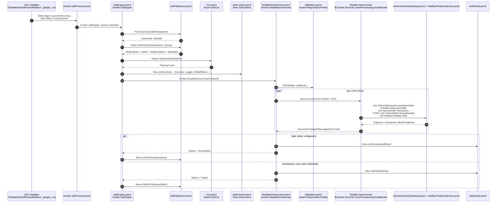

### GenericUser.AddEmailNickname

Pattern: `*AddEMailNickName*_pshjob_.csv`  
Queue: `standard`  
Start im Code: `config/usecases.json` -> `usecases/GenericUser/AddEmailNickname.psm1` -> `Invoke-AddEmailNickname`  
Ende im Code: `JobFileQueue.Move-JobFileToStatus()` -> `done bei Succeeded, failed bei New-JobFailedResult`

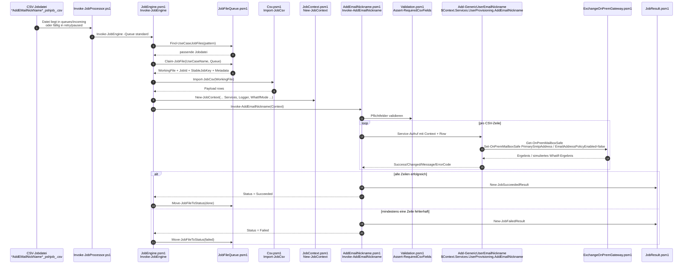

### GenericUser.CreateMultiFunction

Pattern: `*CreateMultiFunctionGenericUser*_pshjob_.csv`  
Queue: `standard`  
Start im Code: `config/usecases.json` -> `usecases/GenericUser/CreateMultiFunctionGenericUser.psm1` -> `Invoke-CreateMultiFunctionGenericUser`  
Ende im Code: `JobFileQueue.Move-JobFileToStatus()` -> `done bei Succeeded, failed bei New-JobFailedResult`

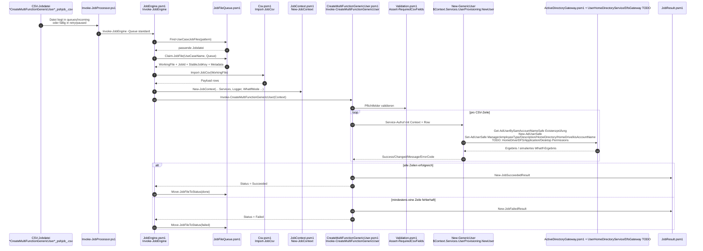

### GenericUser.EnableAdAccountWithGracePeriod

Pattern: `*EnableAdAccountWithGracePeriod*_pshjob_.csv`  
Queue: `standard`  
Start im Code: `config/usecases.json` -> `usecases/GenericUser/EnableAdAccountWithGracePeriod.psm1` -> `Invoke-EnableAdAccountWithGracePeriod`  
Ende im Code: `JobFileQueue.Move-JobFileToStatus()` -> `done bei Succeeded, failed bei New-JobFailedResult`

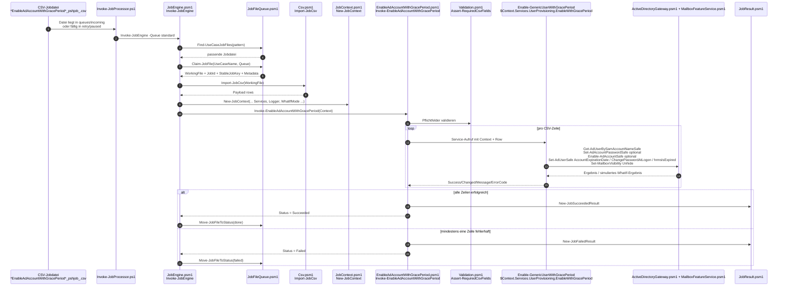

### GenericUser.ModifyMobilePhoneNumber

Pattern: `*ModifyMobilePhoneNumber*_pshjob_.csv`  
Queue: `standard`  
Start im Code: `config/usecases.json` -> `usecases/GenericUser/ModifyMobilePhoneNumber.psm1` -> `Invoke-ModifyMobilePhoneNumber`  
Ende im Code: `JobFileQueue.Move-JobFileToStatus()` -> `done bei Succeeded, failed bei New-JobFailedResult`

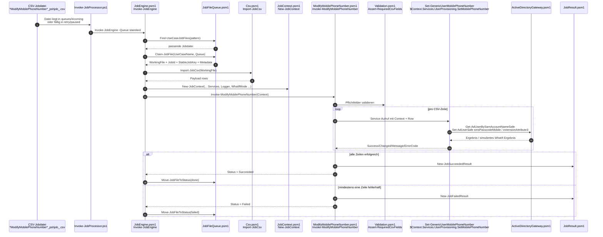

### GenericUser.ModifyMailboxFolderAce

Pattern: `*ModifyMailboxFolderAce*_pshjob_.csv`  
Queue: `standard`  
Start im Code: `config/usecases.json` -> `usecases/GenericUser/ModifyMailboxFolderAce.psm1` -> `Invoke-ModifyMailboxFolderAce`  
Ende im Code: `JobFileQueue.Move-JobFileToStatus()` -> `done bei Succeeded, failed bei New-JobFailedResult / PARTIAL_FAILURE`

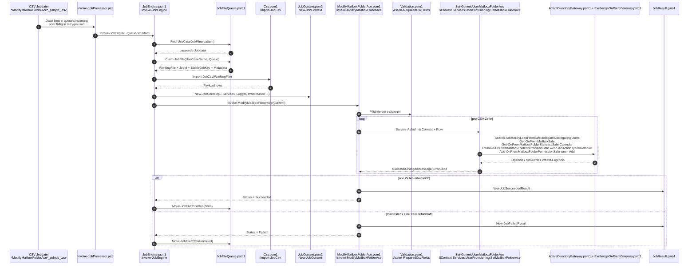

### UserPerson.HospisPersonUseCase

Pattern: `*HospisPersonUseCase*_pshjob_.csv`  
Queue: `standard`  
Start im Code: `config/usecases.json` -> `usecases/UserPerson/HospisPersonUseCase.psm1` -> `Invoke-HospisPersonUseCase`  
Ende im Code: `JobFileQueue.Move-JobFileToStatus()` -> `done bei Succeeded, failed bei New-JobFailedResult`

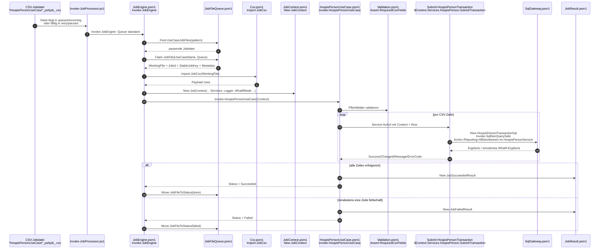

### Urgent.InactivateHospisPerson

Pattern: `*Inaktivieren_HospisPersonUrgentUseCase*_pshjob_.csv`  
Queue: `urgent`  
Start im Code: `config/usecases.json` -> `usecases/Urgent/InactivateHospisPerson.psm1` -> `Invoke-InactivateHospisPerson`  
Ende im Code: `JobFileQueue.Move-JobFileToStatus()` -> `done bei Succeeded, failed bei New-JobFailedResult`

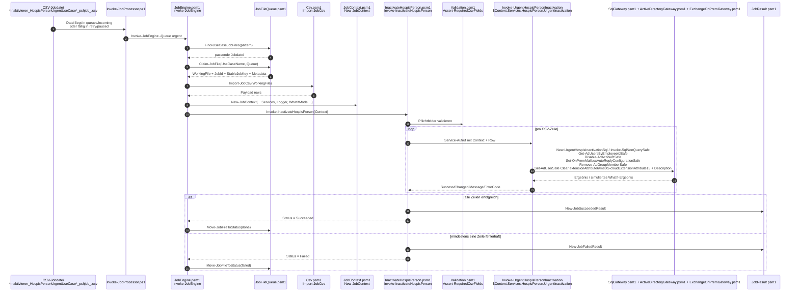

### PersonMailbox.CreateNonStandard

Pattern: `*CreateNonStdPersonMailbox*_pshjob_.csv`  
Queue: `person-mailbox-longrunning`  
Start im Code: `config/usecases.json` -> `usecases/PersonMailbox/CreateNonStdPersonMailbox.psm1` -> `Invoke-CreateNonStdPersonMailbox`  
Ende im Code: pro Zwischenschritt `Move-JobFileToStatus(retry)`, final `Move-JobFileToStatus(done)`


```mermaid
sequenceDiagram
    autonumber
    participant Job as CSV-Jobdatei<br/>*CreateNonStdPersonMailbox*_pshjob_.csv
    participant Runner as Invoke-JobProcessor.ps1<br/>Queue person-mailbox-longrunning
    participant Engine as JobEngine.psm1<br/>Invoke-JobEngine
    participant Queue as JobFileQueue.psm1
    participant Csv as Csv.psm1<br/>Import-JobCsv
    participant Ctx as JobContext.psm1<br/>New-JobContext
    participant Handler as CreateNonStdPersonMailbox.psm1<br/>Invoke-CreateNonStdPersonMailbox
    participant State as JobState.psm1<br/>state/&lt;StableJobKey&gt;.state.json
    participant Svc as PersonMailboxService.psm1
    participant AD as ActiveDirectoryGateway.psm1
    participant EX as ExchangeOnPremGateway.psm1
    participant DFS as DfsGateway.psm1
    participant Result as JobResult.psm1

    Job->>Runner: Datei liegt in queues/incoming oder retry<br/>Pattern erkannt
    Runner->>Engine: Invoke-JobEngine -Queue person-mailbox-longrunning
    Engine->>Queue: Find-UseCaseJobFiles(pattern, retry, optional paused)
    Queue-->>Engine: fällige Datei
    Engine->>Queue: Claim-JobFile(UseCaseName, Queue)
    Queue-->>Engine: WorkingFile + JobId + StableJobKey + Metadata
    Engine->>Csv: Import-JobCsv(WorkingFile)
    Csv-->>Engine: Payload
    Engine->>Ctx: New-JobContext(... StableJobKey, Metadata ...)
    Engine->>Handler: Invoke-CreateNonStdPersonMailbox(Context)
    Handler->>Handler: Assert-RequiredCsvFields<br/>genau 1 Zeile erwartet
    Handler->>State: Get/Initialize State über StableJobKey

    alt Step 10 ValidateInput
        Handler->>Svc: New-NonStandardPersonMailboxPlan(Context, Row)
        Svc-->>Handler: Plan
        Handler->>State: Set-JobStateStep(20)
        Handler->>Result: New-JobRetryResult(RetryAfter +1s)
        Handler-->>Engine: Retry
        Engine->>Queue: Move-JobFileToStatus(retry)
    else Step 20 PrepareAdAccount
        Handler->>Svc: Invoke-PrepareNonStandardPersonMailboxAdAccount(Context, Plan)
        Svc->>AD: Search/Get/New/Set AD User je Plan
        Svc-->>Handler: Result
        Handler->>State: Set-JobStateStep(30)
        Handler->>Result: New-JobRetryResult(RetryAfter +1s)
        Handler-->>Engine: Retry
        Engine->>Queue: Move-JobFileToStatus(retry)
    else Step 30 PrepareMailbox
        Handler->>Svc: Invoke-PrepareNonStandardPersonMailboxMailbox(Context, Plan)
        Svc->>EX: Enable-OnPremMailboxSafe
        Svc-->>Handler: Result
        Handler->>State: Set-JobStateStep(40)
        Handler->>Result: New-JobRetryResult(RetryAfter +1s)
        Handler-->>Engine: Retry
        Engine->>Queue: Move-JobFileToStatus(retry)
    else Step 40 WaitForMailboxVisibility
        Handler->>Svc: Test-NonStandardPersonMailboxVisibility(Context, Plan)
        Svc->>EX: Get-OnPremMailboxSafe
        alt Mailbox noch nicht sichtbar
            Handler->>Result: New-JobRetryResult(RetryAfter +5min)
            Handler-->>Engine: Retry
            Engine->>Queue: Move-JobFileToStatus(retry)
        else Mailbox sichtbar
            Handler->>State: Set-JobStateStep(50)
            Handler->>Result: New-JobRetryResult(RetryAfter +1s)
            Handler-->>Engine: Retry
            Engine->>Queue: Move-JobFileToStatus(retry)
        end
    else Step 50 ApplyAttributes
        Handler->>Svc: Invoke-ApplyNonStandardPersonMailboxAttributes(Context, Plan)
        Svc->>AD: Enable-AdAccountSafe / Set-AdUserSafe
        Svc->>EX: Set-OnPremMailboxSafe / Set-OnPremCASMailboxSafe
        Handler->>State: Set-JobStateStep(60)
        Handler->>Result: New-JobRetryResult(RetryAfter +1s)
        Handler-->>Engine: Retry
        Engine->>Queue: Move-JobFileToStatus(retry)
    else Step 60 Finalize
        Handler->>Svc: Complete-NonStandardPersonMailboxProvisioning(Context, Plan)
        Svc->>DFS: Update-DfsShareSettingsSafe<br/>TODO Details
        Handler->>State: Set-JobStateStep(90)
        Handler->>Result: New-JobRetryResult(RetryAfter +1s)
        Handler-->>Engine: Retry
        Engine->>Queue: Move-JobFileToStatus(retry)
    else Step 90 Done
        Handler->>State: Complete-JobState(Status Completed)
        Handler->>Result: New-JobSucceededResult
        Handler-->>Engine: Succeeded
        Engine->>Queue: Move-JobFileToStatus(done)
    end
```
